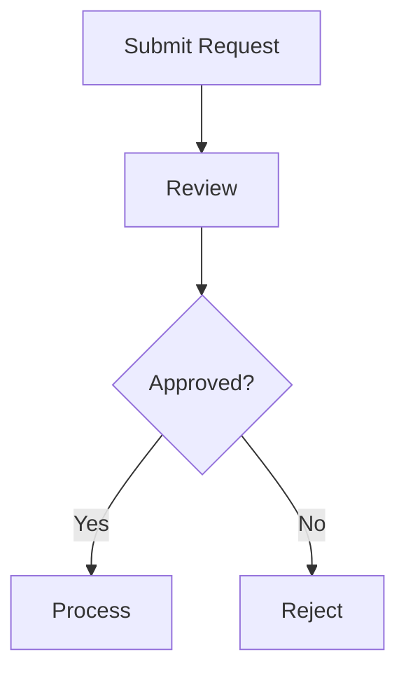

# Knowledge Distillation: A Proof-of-Concept Pipeline

This repository demonstrates how to train a small language model to perform a specific task by learning from examples generated by a larger, more capable model.

The specific task here is generating Mermaid flowcharts from natural language process descriptions. The larger "teacher" model generates high-quality examples, and the smaller "student" model (Qwen 2.5-1.5B) learns to replicate this behavior through fine-tuning.

This is not production code. It is an exploration of the distillation concept, designed to be readable and educational.

---

## Table of Contents

1. [Introduction](#introduction)
   - [What This Project Is](#what-this-project-is)
   - [What We Are Building](#what-we-are-building)
2. [Knowledge Distillation](#knowledge-distillation)
   - [The Core Idea](#the-core-idea)
   - [When Distillation Makes Sense](#when-distillation-makes-sense)
   - [Why Architecture Does Not Matter](#why-architecture-does-not-matter)
   - [Teacher-Student Dynamics](#teacher-student-dynamics)
3. [The Pipeline Overview](#the-pipeline-overview)
   - [Three Phases](#three-phases)
   - [Architecture Diagram](#architecture-diagram)
4. [Phase 1: Data Generation](#phase-1-data-generation)
   - [The Role of Synthetic Data](#the-role-of-synthetic-data)
   - [Domain Coverage Strategy](#domain-coverage-strategy)
   - [Validation Approach](#validation-approach)
5. [Phase 2: Training](#phase-2-training)
   - [Why LoRA?](#why-lora)
   - [How LoRA Works](#how-lora-works)
   - [Configuration Choices](#configuration-choices)
6. [Phase 3: Inference and Evaluation](#phase-3-inference-and-evaluation)
   - [Loading the Distilled Model](#loading-the-distilled-model)
   - [Measuring Success](#measuring-success)
7. [Running the Pipeline](#running-the-pipeline)
   - [Prerequisites](#prerequisites)
   - [Quick Start](#quick-start)
   - [Commands Reference](#commands-reference)
8. [Limitations and What This Does Not Cover](#limitations-and-what-this-does-not-cover)
---

## Introduction

### What This Project Is

This pipeline demonstrates knowledge distillation in practice. The goal is to take a specific capability from a large language model and transfer it to a much smaller one.

The pipeline has three phases:

1. A capable model (the "teacher") generates training examples
2. Those examples are used to fine-tune a smaller model (the "student")
3. The student model is evaluated to see how well it learned the task

The task itself, generating Mermaid flowcharts from process descriptions, is deliberately narrow. Distillation works best when the target task is well-defined and constrained.

### What We Are Building

In this pipeline:

- The **teacher model** generates pairs of (process description, Mermaid flowchart) across 31 different domains
- Each example is validated for correctness before being added to the training set
- The **student model** (Qwen 2.5-1.5B-Instruct, a 1.5 billion parameter model) is fine-tuned on these examples using LoRA
- The fine-tuned model is evaluated against a held-out validation set

The end result is a small model that can take a natural language description like:

> "A customer submits a request which is reviewed and either approved for processing or rejected."

And produce a valid Mermaid flowchart:



---

## Knowledge Distillation

### The Core Idea

A large language model trained on internet-scale data learns an enormous amount of information, patterns, and capabilities. But for any specific task, most of that knowledge is irrelevant. When you ask a large model to generate a Mermaid flowchart, it draws on a tiny fraction of what it knows.

Distillation is based on a simple observation: if a capable model can perform a task, you can record its outputs and use them as training data for a smaller model. The smaller model learns the input-output mapping directly, without needing to rediscover all the underlying patterns from raw data.

This works because learning from demonstrations is fundamentally easier than learning from scratch. When a student model sees examples like "this description maps to this flowchart," it learns the transformation pattern. It does not need to understand software engineering, business processes, or flowchart conventions in the abstract; it just needs to recognize and reproduce the patterns in the training data.

The teacher model acts as a knowledge compressor. It takes its broad understanding and produces focused, task-specific examples that capture the essence of what the student needs to learn.

### When Distillation Makes Sense

Distillation is a good fit when several conditions hold:

**You have a specific, well-defined task.** Distillation works best when you can clearly articulate what the model should do. "Generate Mermaid flowcharts from process descriptions" is specific. "Be helpful" is not.

**You need efficient inference.** If you are running inference once a day, the cost difference between a large and small model may not matter. If you are running thousands of inferences per minute, it adds up quickly. Distillation pays off when you need the output frequently.

**A larger model can reliably perform the task.** The teacher needs to be good enough at the task to generate high-quality training data. If the teacher produces inconsistent or incorrect outputs, the student will learn those mistakes.

**You can validate the outputs.** Synthetic data is only useful if you can verify its quality. In this project, Mermaid code can be syntactically validated. For other tasks, you might need human review or automated test suites.

Distillation is not the right choice when:

- The task is too open-ended or requires general reasoning
- You need the full capabilities of a large model
- The task is simple enough that a small model already handles it without additional training

### Why Architecture Does Not Matter

One of the most useful properties of knowledge distillation is that it is architecture-agnostic. The teacher and student models do not need to share the same architecture, the same tokenizer, or even the same training methodology.

This is fundamentally different from other model compression techniques like pruning or quantization, which operate directly on model weights. Those techniques require you to work within the constraints of a single model's architecture.

Distillation, by contrast, transfers knowledge through examples. The teacher and student communicate through input-output pairs, not through shared internal representations. A GPT-based teacher can train a Llama-based student. A closed-source API can generate training data for an open-source model.

This matters for practical reasons:

- You can use the best available model as your teacher, regardless of whether its weights are available
- You can choose your student architecture based on deployment constraints (size, speed, licensing)
- You can switch teachers or students without redesigning the pipeline

In this project, any capable model could serve as the teacher. The pipeline does not depend on a specific teacher architecture.

### Teacher-Student Dynamics

The quality of distillation depends on the relationship between teacher and student.

**The teacher does not need to be perfect.** It needs to be consistently better than random for the target task. If the teacher produces valid Mermaid flowcharts 90% of the time, the student can still learn from that data, especially if you filter out the invalid examples. Perfection is not required; reliability is.

**Quality matters more than quantity.** A common mistake in synthetic data generation is optimizing for volume. 500 high-quality, diverse examples often produce better results than 5,000 repetitive or inconsistent ones. The student learns patterns from the training data. If the data contains contradictions or low-quality examples, the student learns those too.

**The student learns patterns, not memorization.** A well-trained student generalizes beyond the exact examples it saw during training. It learns the underlying mapping from input structure to output structure. This is why diverse training data matters: it helps the student learn robust patterns rather than overfitting to specific examples.

---

## The Pipeline Overview

### Three Phases

The pipeline consists of three sequential phases:

1. **Data Generation**: The teacher model generates (description, flowchart) pairs across multiple domains. Each pair is validated for correctness before being added to the dataset.

2. **Training**: The student model is fine-tuned on the generated data using LoRA (Low-Rank Adaptation), which updates only a small fraction of the model's parameters.

3. **Inference and Evaluation**: The fine-tuned model is tested on held-out examples to measure how well it learned the task.

Each phase is independent and can be run separately. You can generate more data without retraining, or retrain with different hyperparameters without regenerating data.

### Architecture Diagram

```
┌─────────────────────────────────────────────────────────────────┐
│                     PHASE 1: DATA GENERATION                    │
├─────────────────────────────────────────────────────────────────┤
│                                                                 │
│   Teacher Model ──► Generate Examples ──► Validate ──► Store   │
│                          │                   │                  │
│                   31 domains × 5 topics   Syntax +              │
│                   × 3 complexity levels   Constraints           │
│                                                                 │
└─────────────────────────────────────────────────────────────────┘
                              │
                              ▼
                      training_data.jsonl
                      validation_data.jsonl
                              │
                              ▼
┌─────────────────────────────────────────────────────────────────┐
│                       PHASE 2: TRAINING                         │
├─────────────────────────────────────────────────────────────────┤
│                                                                 │
│   Qwen 2.5-1.5B ──► Apply LoRA ──► Fine-tune ──► Save Adapter  │
│   (frozen base)      (trainable)      (SFT)                     │
│                                                                 │
└─────────────────────────────────────────────────────────────────┘
                              │
                              ▼
                      LoRA adapter weights
                              │
                              ▼
┌─────────────────────────────────────────────────────────────────┐
│                 PHASE 3: INFERENCE & EVALUATION                 │
├─────────────────────────────────────────────────────────────────┤
│                                                                 │
│   Base Model + Adapter ──► Generate ──► Validate ──► Metrics   │
│                                                                 │
│   Compare: Fine-tuned vs Base model performance                 │
│                                                                 │
└─────────────────────────────────────────────────────────────────┘
```

---

## Phase 1: Data Generation

### The Role of Synthetic Data

The training data in this pipeline is entirely synthetic, generated by the teacher model rather than collected from existing sources. This approach has several advantages:

**Control over format and quality.** Every example follows the exact format the student needs to learn. There is no noise from inconsistent formatting, legacy conventions, or edge cases that do not match the target task.

**Domain coverage by design.** Instead of hoping that existing datasets cover the domains you care about, you can explicitly generate examples for specific domains, topics, and complexity levels.

**Validation at generation time.** Each example can be validated before it enters the training set. Invalid examples are rejected and regenerated, ensuring the student only learns from correct outputs.

The downside of synthetic data is that it is only as good as the teacher model. If the teacher has blind spots or biases, those will propagate to the training data and, ultimately, to the student.

### Domain Coverage Strategy

The data generation covers 31 domains, each with 5 topics and 3 complexity levels (simple, moderate, complex). This creates 465 unique combinations, ensuring the student sees diverse examples during training.

**Complexity levels control the flowchart structure:**

| Level | Node Count | Description |
|-------|------------|-------------|
| Simple | 3-4 nodes | Linear flows with minimal branching |
| Moderate | 5-6 nodes | Some decision points and branches |
| Complex | 7-8 nodes | Multiple decision points and paths |

The goal is a balanced training distribution. The student should learn to generate flowcharts across domains and complexity levels, not just memorize patterns from a narrow slice of examples.

See `data_generation/domains.py` for the complete domain and topic definitions.

### Validation Approach

Generated examples go through a two-layer validation process before being added to the training set.

**Constraint validation** (fast, local) checks structural requirements:

- Must start with `flowchart TD`
- Node count between 2 and 8
- Label length at most 4 words per node
- Must contain at least one arrow (`-->`)

**Syntax validation** (slower, external) verifies the Mermaid code is actually valid:

- Uses the `mermaid-py` library to hit the mermaid.ink rendering service
- An HTTP 200 response confirms the syntax is correct
- Invalid syntax is rejected with an error message

This two-layer approach balances speed and thoroughness. Constraint validation catches obvious structural problems immediately. Syntax validation catches subtle issues that constraint checking might miss.

The principle here is "garbage in, garbage out." If invalid examples make it into the training data, the student learns to produce invalid outputs. Strict validation at generation time prevents this.

See `data_generation/validator.py` for the validation implementation.

---

## Phase 2: Training

### Why LoRA?

Fine-tuning a language model traditionally means updating all of its parameters. For a 1.5 billion parameter model, this requires substantial GPU memory and compute. It also requires enough training data to avoid catastrophic forgetting, where the model loses its general capabilities while learning the new task.

LoRA (Low-Rank Adaptation) takes a different approach. Instead of updating all parameters, it freezes the base model and adds small trainable matrices alongside the original weights. Only these added matrices are updated during training.

The intuition behind LoRA is that task-specific adaptations are "low-rank." When you fine-tune a model for a specific task, you are not fundamentally restructuring its knowledge. You are making a relatively small adjustment to how it processes inputs and generates outputs. This adjustment can be captured by matrices much smaller than the original weights.
---

## Phase 3: Inference and Evaluation

### Loading the Distilled Model

Inference with a LoRA fine-tuned model requires loading both the base model and the adapter:

1. Load the base model (Qwen 2.5-1.5B-Instruct)
2. Load the LoRA adapter weights from the output directory
3. The adapter attaches to the base model, modifying its behavior

The adapter files are small (a few megabytes), while the base model is large (several gigabytes). This separation is useful for deployment: you can share a single base model across multiple adapters for different tasks.

Optionally, you can merge the adapter weights into the base model. This creates a single set of weights with no adapter overhead, but you lose the ability to swap adapters without reloading.

See `training/inference.py` for the inference implementation.

### Measuring Success

The evaluation compares the fine-tuned model against the base model (without fine-tuning) on the same validation set. Several metrics capture different aspects of performance:

**Syntax validity**: Does the generated Mermaid code pass the mermaid.ink syntax checker? This is a binary pass/fail for each example.

**Constraint compliance**: Does the output follow the structural rules (node count, label length, etc.)? Again, binary pass/fail.

**Exact match**: Does the generated output exactly match the ground truth? This is a strict metric that rarely reaches high values, since there are many valid ways to express the same flowchart.

**BLEU score**: A softer similarity metric that compares n-gram overlap between generated and reference outputs. Higher is better.

**Edit distance**: Normalized Levenshtein distance between generated and reference outputs. Lower is better.

**Structural metrics**: Node count, edge count, presence of decision nodes, use of edge labels. These capture whether the model is generating structurally appropriate flowcharts.

The evaluation also breaks down results by complexity level (simple, moderate, complex) to understand where the model performs well and where it struggles.

See `training/evaluate.py` for the full evaluation implementation.

---

## Running the Pipeline

### Prerequisites

- Python 3.10 or higher
- UV package manager (https://docs.astral.sh/uv/)
- GPU recommended for training (CUDA or Apple MPS)
- CPU works but is significantly slower

### Quick Start

```bash
# Install dependencies
uv sync

# Train the model (assumes training data exists)
python -m training.train

# Evaluate the fine-tuned model
python -m training.evaluate

# Interactive chat with the fine-tuned model
python -m training.chat
```

### Commands Reference

| Command | Description |
|---------|-------------|
| `uv sync` | Install all dependencies |
| `python -m training.train` | Run LoRA fine-tuning |
| `python -m training.inference` | Run example inferences |
| `python -m training.evaluate` | Evaluate model performance |
| `python -m training.evaluate --model base` | Evaluate base model only |
| `python -m training.evaluate --model finetuned` | Evaluate fine-tuned model only |
| `python -m training.evaluate --samples 50` | Evaluate on 50 samples |
| `python -m training.chat` | Interactive chat interface |
| `python -m data_generation.claude_helper rules` | Show data generation rules |
| `python -m data_generation.claude_helper status` | Check generation progress |

---

## Limitations and What This Does Not Cover

This is exploratory code, not production-ready. Several limitations are worth noting:

**Single, narrow task.** The pipeline is designed for Mermaid flowchart generation. It does not demonstrate multi-task distillation, continual learning, or task transfer.

**Arbitrary constraints.** The Mermaid constraints (2-8 nodes, 4 words per label) are chosen for demonstration purposes. Real applications would have domain-specific requirements.

**Limited evaluation.** The evaluation uses automated metrics only. There is no human evaluation of output quality, no user studies, and no production load testing.

**No hyperparameter tuning.** The configuration uses reasonable defaults, not optimized values. A production system would benefit from systematic hyperparameter search.

**No deployment considerations.** The code runs locally. Production deployment would require model serving infrastructure, latency optimization, and monitoring.

**No comparison with alternatives.** The project does not compare distillation against other approaches (few-shot prompting, retrieval augmentation, different base models).

---
